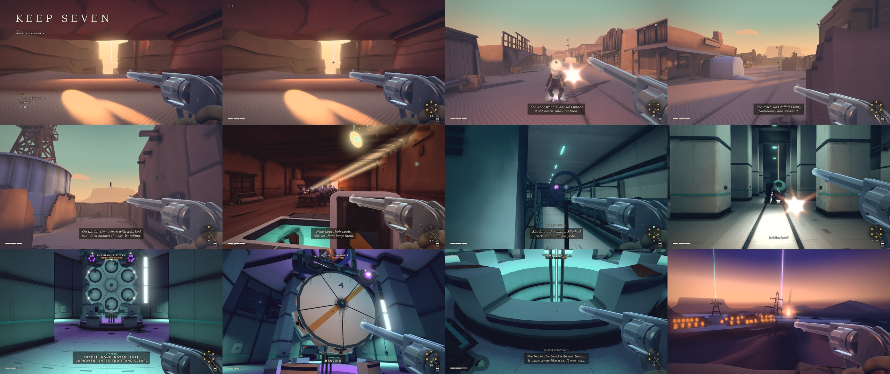

# KEEP SEVEN — First Tally: Plenty

A browser first-person shooter: one complete stage in the style of Stephen King's
*Dark Tower* series (western, decayed far future, quiet horror). The world, names and
text are original; nothing is taken from the books.

You play the last sworn Reeve. She carries six rounds for the work and a sealed
seventh she has vowed never to fire, and she is tracking a man who spoils wells through
a shuttered desert town and down into the machine under it.



## Play it

Built and tested with Node 24; needs a browser with WebGL2.

```bash
npm install
npm run dev
```

Open the URL it prints. A production build is `npm run build`, then `npx vite preview`.

| | |
|---|---|
| Move | `W A S D` or arrows, `Shift` runs, `Space` jumps |
| Look / fire | mouse / left click |
| Reload | `R` — one round at a time; firing interrupts it |
| Line round | `Q` |
| Kept round | `F` — only where the game allows it |
| Interact | `E` |
| Pause | `Esc` or `P` |
| Performance overlay | `F3` |

Every key can be rebound in Options, which also has sensitivity, field of view,
difficulty, subtitles and captions, reduce flashes / shake / motion, and graphics
quality. Adding `?cp=<checkpoint id>` to the dev URL starts at a checkpoint.

## Status

A vertical-slice demo, built over one pre-production pass, one production round and
three polish rounds (rounds 2 to 4), each judged by reviewers who had not built the
work. A scripted bot finishes the stage from the title to the end card by input alone.

**Not yet verified by a person:** frame rate on a real GPU (all automated testing ran
on a software renderer), the audio (it is synthesized at runtime and has only been
measured, never listened to), and how it plays in human hands. Known gaps are listed at
the top of [`docs/INTEGRATION_REPORT.md`](docs/INTEGRATION_REPORT.md).

### Playtesting

If you are playtesting, the most useful reports are: your GPU and the frame rate the
`F3` overlay shows in each area, anything that looked wrong or unfinished (with a
screenshot), any moment you did not know what to do, any fight that felt unfair or
trivial, and anything about the sound.

## How it is built

- **Runtime:** three.js (WebGL2), TypeScript, Vite. No game engine.
- **Art:** every model, rig, animation, texture and baked light comes from a headless
  Blender 4.5 Python script in [`blender/`](blender/). The built files in
  `public/assets/` are committed, so you do not need Blender to play.
- **Audio:** synthesized with WebAudio at runtime. There are no audio files.
- **Performance target:** 60 fps on a 2017-era integrated GPU at 720p on the Low tier,
  with baked lighting, hard per-area budgets and adaptive resolution.

| Folder | What is in it |
|---|---|
| `src/` | the game: `core`, `player`, `enemies`, `world`, `render`, `ui`, `audio` |
| `blender/` | asset scripts and the shared pipeline library |
| `design/` | level layout, asset manifest and all player-facing text, as data |
| `docs/` | design document, art bible, architecture, level walkthrough, reports |
| `tests/` | unit, browser and end-to-end tests, including the full playthrough |
| `tools/` | asset build, validation and preview tools |

To rebuild assets from the Blender scripts, `tools/setup-env.sh` fetches Blender and
the test browser into `.tools/` (Linux, no root needed), then `npm run assets`.

Useful checks: `npm run typecheck`, `npm run validate`, `npm run test:unit`,
`npm run check:assets`, `node --test tests/e2e/`.
